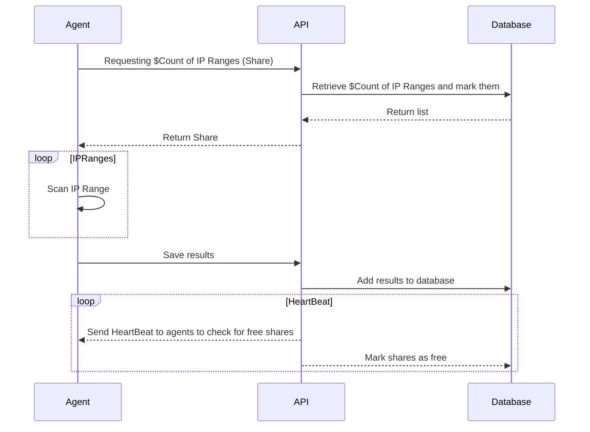

# SimpleAgent

A simple agents system that's used to monitor a list of IP Ranges.

Still playing with some stuff

## What it should do
A Share is a list of ip ranges that the agent scans to determine which ip ranges are being scanned and which are not.
An Agent requests a share based on the machine's capabilities to make sure ip ranges are being scanned on daily basis.

